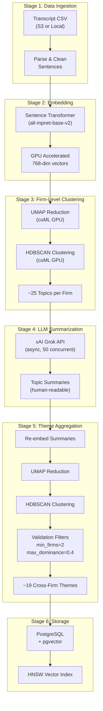
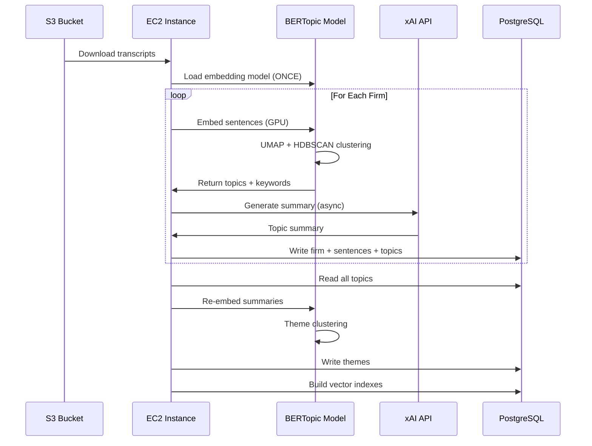
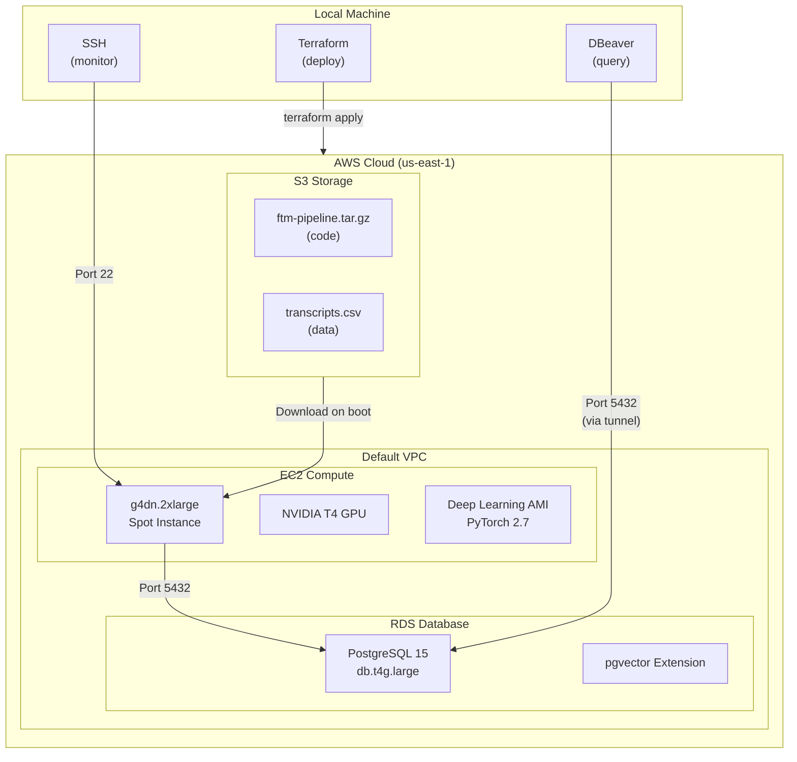
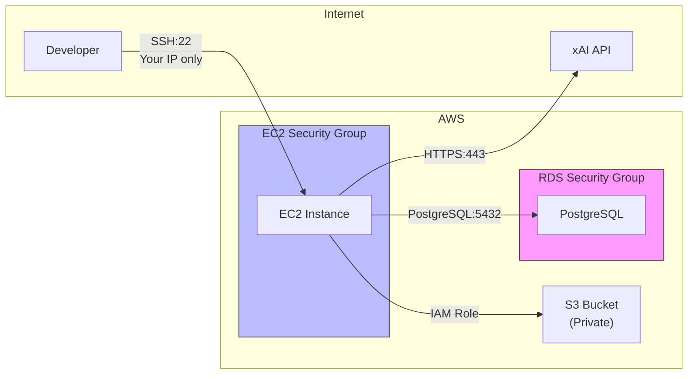
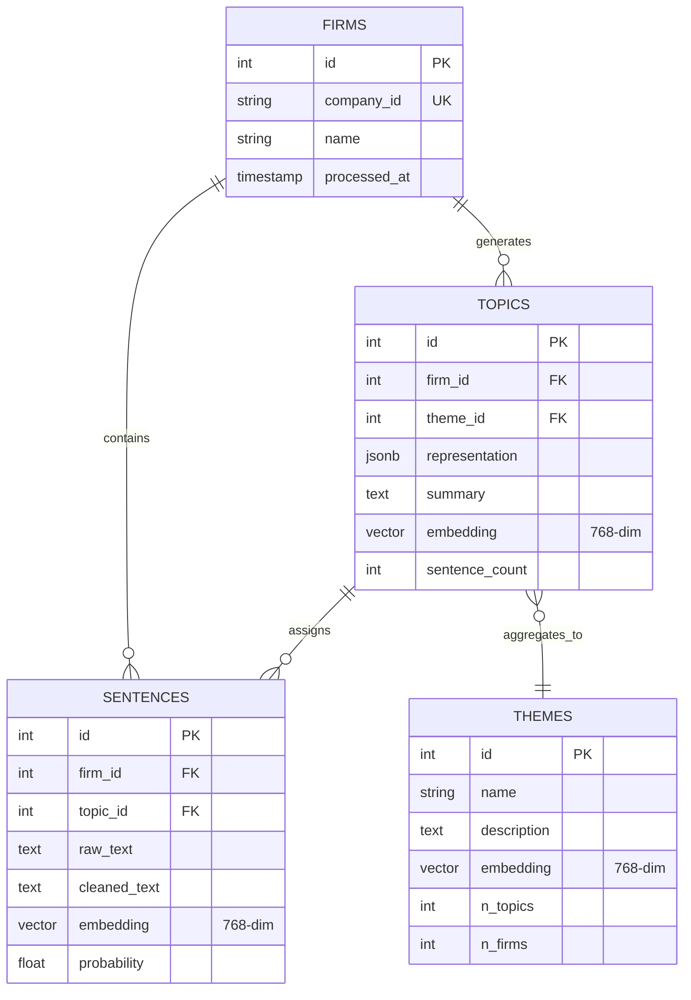
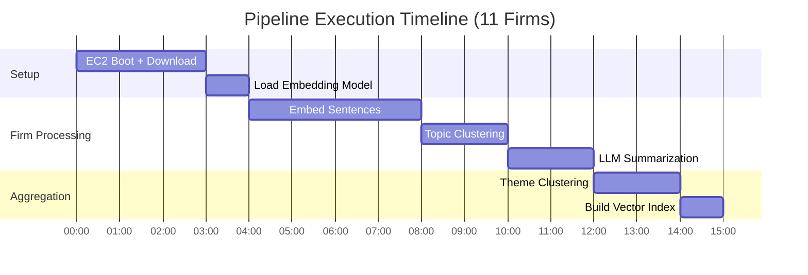
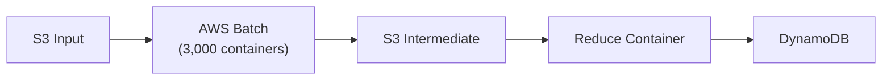
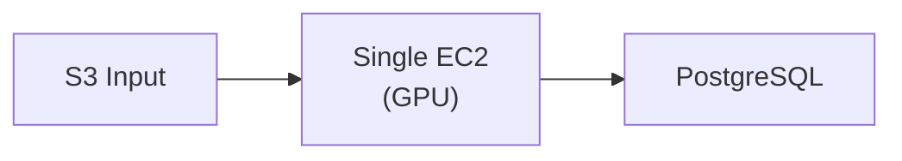

# Architecture Diagram

## System Overview

The Financial Topic Modeling Pipeline is a hierarchical NLP system that identifies cross-firm investment themes from earnings call transcripts.

---

## Pipeline Architecture

---

## Data Flow (Per Firm)

---

## Infrastructure Architecture

---

## Security Architecture

**Security Controls:**

- EC2: SSH restricted to single IP (developer workstation)
- RDS: Accepts connections only from EC2 security group
- S3: Block all public access, IAM role-based access
- LLM: Outbound HTTPS only, no PII transmitted

---

## Database Schema (ERD)

---

## Processing Timeline (MAG7 Run)

**Total: ~15 minutes**

---

## Comparison: Original vs Final Architecture

### Original Design (AWS Batch)

**Problems:**

- 3,000 cold starts (60s each)
- Model loaded 3,000 times
- S3 round-trips for intermediate data
- DynamoDB N+1 query issues

### Final Design (Single GPU)

**Benefits:**

- 1 model load
- No intermediate storage
- Relational queries
- 90% cost reduction

---

## Key Metrics

| Component            | Specification                    |
| -------------------- | -------------------------------- |
| Embedding Model      | all-mpnet-base-v2 (768-dim)      |
| GPU                  | NVIDIA T4 (16GB VRAM)            |
| Database             | PostgreSQL 15 + pgvector         |
| Vector Index         | HNSW (ef_construction=128, m=16) |
| LLM                  | xAI grok-4-1-fast-reasoning      |
| Concurrent LLM Calls | 50 (semaphore-limited)           |

---

_Source: [docs/ARCHITECTURE.md](../../../docs/ARCHITECTURE.md)_
